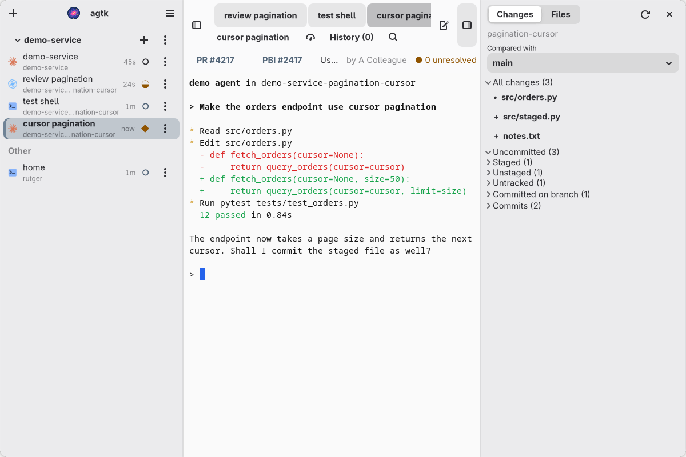

# agtk

A native GNOME workspace for running many coding agents at once.

agtk runs Claude Code, Codex, Gemini and plain shells side by side in one window, grouped by project and git worktree. It shows which agent needs you, what each one changed, and keeps every session running even when the window closes.



## Highlights

- **Know which agent needs you.** Every session shows a live state: busy, waiting for input, ready for review, or idle. `Ctrl+Shift+Space` jumps to the next session that is ready.
- **Sessions outlive the window.** Each terminal runs in its own process. Close, crash, or rebuild agtk and it reattaches to every running agent. After a reboot it offers to resume each conversation where it stopped.
- **Worktree-native.** Launch an agent in a fresh worktree with a generated branch in one step. Removing a worktree saves uncommitted work and tags the branch tip first, so nothing is lost.
- **Review without leaving the window.** The Changes sidebar shows staged, unstaged, branch and commit diffs for the session's worktree. File paths in the terminal open in the built-in viewer at the right line.
- **Scriptable and agent-controllable.** `agtkctl` and an MCP server expose sessions, terminal text, diffs, worktrees and pull requests over a local socket, so scripts and agents can start and supervise other agents. Nothing listens on the network.
- **Native, not Electron.** Built in Rust with GTK 4 and libadwaita. Each session is a real VTE terminal with true color, search and prompt history.
- **Zero agent setup.** Claude Code reports its state through hooks that agtk generates on the fly. The installer adds the agtk MCP server to Claude Code and Codex, so agents can use agtk right away.

## Project status

agtk is developed and used daily on Arch Linux with GNOME on Wayland. Other distributions and desktops are untested, and the interface and command line may change between versions.

## Install

Paste this into Claude Code, Codex, or another coding agent. It checks agtk before running anything, and asks you before it installs.

```text
I'd like to try agtk, a GNOME app for running coding agents side by side: https://github.com/rjprins/agtk

1. Clone it into a directory of your choice and tell me where.
2. Before running anything from it, check that it is safe to build and run. Read build.rs and the scripts in scripts/. Look through the source for network access, commands run as root, and files written outside the clone, ~/.local, and agtk's own state and runtime directories. Note what the build downloads (Cargo.lock and viewer/package-lock.json) and what the installer changes in my Claude Code and Codex settings. Tell me what you found.
3. Check my system against the requirements in the README. Tell me what is missing and how to install it, but don't install system packages yourself.
4. Ask me whether to go ahead. Only when I say yes, run ./scripts/install-local.sh and start agtk detached from your shell, for example with `setsid -f ~/.local/bin/agtk`.
```

To install by hand, install the [requirements](#requirements), clone the repository, and run:

```sh
./scripts/install-local.sh
```

This builds agtk and installs it with a GNOME launcher under `~/.local`. Start "agtk" from the GNOME overview, or run `~/.local/bin/agtk`.

- To install somewhere else, set `PREFIX` to an absolute path.
- To upgrade, run the installer again.
- The installer adds `agtk-mcp` as an MCP server named `agtk` to Claude Code and Codex, when they are installed. See [MCP](#mcp).
- To remove agtk, run `./scripts/uninstall-local.sh`. It also removes the `agtk` MCP server. Your saved sessions and settings are kept.

If agtk does not start from the overview, look in the user journal for its output.

### Requirements

- Linux with GNOME on Wayland
- GTK 4.22, libadwaita 1.9, VTE 0.84, WebKitGTK 6.0, and SQLite
- Rust 1.92 or newer
- Node.js and npm, only to build the Changes viewer

On Arch Linux:

```sh
sudo pacman -S gtk4 libadwaita vte4 webkitgtk-6.0 sqlite rust nodejs npm
```

Optional tools:

- `claude`, `codex`, or `gemini` for the agents you want to run
- The Azure CLI with the Azure DevOps extension, signed in, for pull requests
- `emacsclient` for the Emacs actions

## Your agtk

agtk is meant to keep changing to fit how you work. When it starts with nothing open, it opens Claude Code in its own source code, or Codex when Claude Code is not installed. That agent explains any feature, helps set up the integrations, and changes or adds features when you ask. After a change it rebuilds agtk. Restart agtk to use the new build: your sessions keep running while it restarts.

Without Claude Code or Codex, or when the source directory agtk was built from is gone, agtk opens a shell instead.

## Features

### Sessions

- Sessions are grouped by project in the sidebar. Each project has buttons to launch, pin, resume, and manage worktrees and pull requests.
- When the last session in a project closes, the project moves to Inactive Projects at the bottom of the sidebar. Click it to launch a session there. Use the star to pin it, or the trash button to remove it from the list. This does not delete any files.
- A pinned project stays at the top of the sidebar, even without sessions. Pin or unpin a project from its menu.
- Launch Claude, Codex, Gemini, a shell, or a custom command in an exact directory and worktree.
- Sessions keep running when the window closes, crashes, or is rebuilt. Start agtk again and it attaches to them.
- Each agent row shows a state: busy, waiting, ready, or idle. See [Agent states](#agent-states).
- Resume a closed Claude or Codex conversation with `Ctrl+Shift+R`. The list shows where each one stopped and which files it changed.
- Restart Agent in the row menu stops an agent and resumes the same conversation, so an updated Claude or Codex takes over. Restart Idle Agents in the main menu does this for every agent that is between turns.
- Fork Conversation in the row menu starts a copy of a Claude or Codex conversation in a new row below it. The original keeps running. Both agents use the same worktree, so give them work on different files.
- Switch Claude model and effort with presets.
- Closing the last session in a worktree offers to remove the worktree too. Uncommitted changes are saved to the attic first, and the branch can go with it after an attic tag.

Sessions do not survive a reboot, and terminal scrollback is not saved. After a reboot, agtk lists the sessions that were open and offers to start them again: agents resume their conversation, shells open in the same directory. Later, press Enter in the terminal of an exited agent to resume it.

### Terminal

- True color, search, copy and paste, and prompt history.
- Selected text is copied to the clipboard.
- Click a file path such as `src/main.rs:42:7` to open it in the file viewer at that line. Click a URL to open it in the browser.
- `Ctrl++` and `Ctrl+-` scale the font of the whole window.

### Changes and files

- The Changes sidebar shows staged, unstaged, untracked, branch, and commit diffs. It is read only.
- Choose what to compare with: a branch, or a number of commits back.
- The Files page lists every file in the worktree, with a filter. Files open read only in the same viewer.

### Worktrees

- Create a worktree with a generated branch name from the launch dialog.
- Remove a finished worktree safely. agtk saves uncommitted work and tags the branch tip before it deletes anything.

### Integrations

- Azure DevOps pull requests: see PRs that need your attention, and start a review in its own detached `pr-<id>` checkout next to the project. Review sessions open in the background and do not take the selection, and so do sessions started by `agtkctl` or an agent over MCP.
- A session that works on a PR, or reviews one, shows a PR button in its sidebar row and a PR bar above its terminal. Both open the PR in the browser.
- Emacs: open Magit or a branch review for the selected session.
- A command line tool (`agtkctl`) and an MCP server (`agtk-mcp`) control agtk from scripts and agents. Both use a local socket. Nothing listens on the network.

## Keyboard shortcuts

These work while the terminal has focus. Change them under Keyboard Shortcuts in the main menu.

| Action | Default |
| --- | --- |
| Launch in the selected session's project and worktree | `Ctrl+Shift+Backquote` |
| Close selected session | `Ctrl+Shift+Q` |
| Toggle sidebar | `Ctrl+Shift+Backslash` |
| Next or previous session | `Ctrl+Shift+]` or `Ctrl+Shift+[` |
| Next ready session | `Ctrl+Shift+Space` |
| Back to last visited session | `Ctrl+Shift+L` |
| Resume a closed agent session | `Ctrl+Shift+R` |
| Reopen PR list | `Alt+Shift+P` |
| Switch Claude model preset | `Ctrl+Shift+M` |
| Copy or paste | `Ctrl+Shift+C` or `Ctrl+Shift+V` |
| Search terminal | `Ctrl+Shift+F` |
| Increase or decrease font size | `Ctrl++` or `Ctrl+-` |

The Claude preset shortcut opens a chooser for the selected Claude session. Press the shortcut again to move to the next preset, Enter to apply it, and Escape to cancel. Apply a preset only when Claude is at an empty prompt.

## Agent states

| Glyph | State | Meaning |
|---|---|---|
| ◐ | busy | The agent is working on a turn |
| ◆ | waiting | Blocked on you: a permission prompt, dialog, question, or usage limit |
| ● | ready | The turn finished and you have not viewed it yet |
| ○ | idle | Nothing is running, or you viewed the finished turn |

Staying on a ready session for 7 seconds marks it as viewed, so a quick pass through the list leaves the mark alone. The timer shows how long the session has been in its state.

Claude sessions report their state through hooks that agtk generates. You do not need to change your Claude configuration. Codex and Gemini sessions are read from the screen once a second, with status rules ported from [agent-manager](https://github.com/YoanWai/agent-manager).

## Control from the command line

`agtkctl` prints JSON to stdout.

```sh
agtkctl state
agtkctl session create --kind codex --cwd /absolute/project
agtkctl session text SESSION_ID --lines 200
agtkctl session restart SESSION_ID
agtkctl session fork SESSION_ID
agtkctl ui inspect
agtkctl ui capture
agtkctl ui show changes
agtkctl ui diff SESSION_ID --scope unstaged --path src/main.rs
agtkctl pr list /absolute/project
agtkctl claude presets
agtkctl claude apply SESSION_ID opus-high
```

Run `agtkctl --help` to see every command. Add `--instance NAME` before the command to talk to another instance than `default`.

Processes inside a session get `AGTK_INSTANCE`, `AGTK_SESSION_ID`, and `AGTK_CONTROL_SOCKET`. A hook of your own can report the agent state:

```sh
agtkctl session state "$AGTK_SESSION_ID" busy
```

The states are `busy`, `waiting`, `ready`, and `idle`. Add `--hook-input` when the command runs as a Claude Code hook.

## MCP

`./scripts/install-local.sh` adds `agtk-mcp` to Claude Code and Codex as a user-wide MCP server named `agtk`. Restart running agents to give them the tools: use Restart Idle Agents in the main menu.

Without `--instance`, `agtk-mcp` talks to the instance of the session it runs in, or `default` outside agtk.

To add it to another MCP client, use it as a local stdio server:

```json
{
  "mcpServers": {
    "agtk": {
      "command": "/home/you/.local/bin/agtk-mcp"
    }
  }
}
```

An agent can open a shell with `spawn_shell` and give it an `initialCommand`, such as a `sudo` command. Type the password in that shell, and the agent reads the result with `snapshot`. agtk itself never runs anything as root.

Sessions that agtk starts run outside any sandbox the agent has. An agent with the `agtk` tools can therefore run commands beyond its own sandbox, through `spawn_shell`, `send_input`, or `launch_agent`. Give the tools only to agents you would let run commands. PR reviews start Codex without the `agtk` tools, because they read code from someone else.

The tools cover sessions, terminal input and text, diffs, worktrees, recent conversations, Claude presets, Emacs actions, pull requests, and screenshots of the agtk window. The server never captures the rest of the desktop.

## Where things are stored

- Settings and session data: `$XDG_STATE_HOME/agtk/default`, or `~/.local/state/agtk/default`
- Sockets and Claude hook settings: `$XDG_RUNTIME_DIR/agtk/default`, or `/tmp/agtk-UID/agtk/default` without `XDG_RUNTIME_DIR`. agtk makes these directories private to you and refuses one that someone else can change.
- Worktrees: next to the project, as `../REPO-BRANCH`, or where `git config agtk.worktreeTemplate` says. PR reviews: `../pr-ID`.
- Work saved before a worktree is removed: `attic` in the settings directory. agtk stages it in a private directory under `/tmp` first.

agtk makes no network requests itself. Pull requests go through the Azure CLI, and a PR review fetches the branch with `git fetch`. Building agtk downloads the crates in `Cargo.lock` and the npm packages in `viewer/package-lock.json`, without running their install scripts.

To use another program for a tool, set `AGTK_CLAUDE_BIN`, `AGTK_CODEX_BIN`, `AGTK_EMACSCLIENT`, or `AGTK_AZURE_BIN`.

## Development

agtk has four binaries:

- `agtk` is the GTK window with the terminals.
- `agtk-session` runs one terminal process. This is why sessions survive a restart of the window.
- `agtkctl` is the command line tool.
- `agtk-mcp` is the MCP server.

To try a change, run `./scripts/install-local.sh` and restart agtk. The installer makes a debug build with optimized dependencies, so it takes seconds after a change. Sessions keep running while agtk restarts.

Run the checks:

```sh
cargo fmt --all -- --check
cargo test --all-targets
cargo clippy --all-targets -- -D warnings
```

Render the UI without touching your running agtk or your desktop:

```sh
scripts/ui-preview.sh              # capture the main window and every dialog
scripts/ui-preview.sh --dark launch
```

The script needs `mutter` and `sqlite3`. It starts a private headless compositor and a separate instance with demo sessions, and prints the PNG paths. Add `--keep` to leave the instance running so you can drive it with `agtkctl`.

The UI tests use the same kind of compositor. Start one, then run:

```sh
AGTK_TEST_DISPLAY=$XDG_RUNTIME_DIR/DISPLAY_NAME cargo test --test native_ui -- --ignored --test-threads=1
```

## Acknowledgements

- [Orca](https://github.com/stablyai/orca) inspired the idea. agtk puts agent sessions first and treats the worktree as their context.
- The Codex and Gemini status rules are ported from [agent-manager](https://github.com/YoanWai/agent-manager).

## License

MIT. See [LICENSE](LICENSE).
